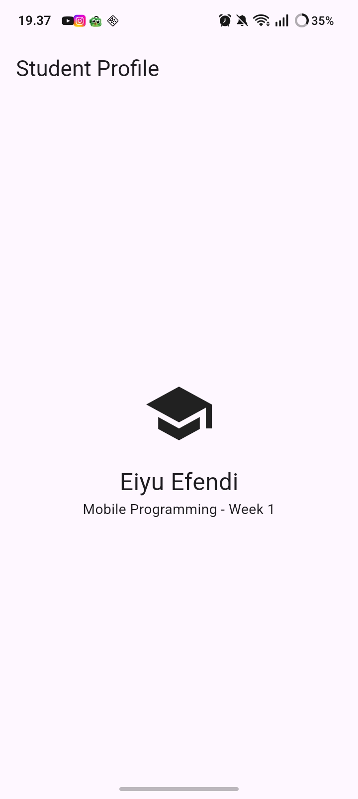

# my_first_apps

A new Flutter project.

## Getting Started

This project is a starting point for a Flutter application.

A few resources to get you started if this is your first Flutter project:

- [Learn Flutter](https://docs.flutter.dev/get-started/learn-flutter)
- [Write your first Flutter app](https://docs.flutter.dev/get-started/codelab)
- [Flutter learning resources](https://docs.flutter.dev/reference/learning-resources)

For help getting started with Flutter development, view the
[online documentation](https://docs.flutter.dev/), which offers tutorials,
samples, guidance on mobile development, and a full API reference.

## Verification checklist
-flutter doctor has no issue blocking the Android target.
-flutter devices detects an emulator or physical device.
-The application runs and its default UI has been replaced with a simple profile.
-You can explain the difference between hot reload and hot restart.
-The remote repository contains source code, README, screenshots, and commit history.

-Hot Reload : Use Hot Reload for rapid UI iteration. Because it preserves state, it is incredibly useful when we are deep inside an application.

-Hot Restart : Use Hot Restart when making a structural changes to the app that require the code to run from the very beginning to take effect.

## Reflection

- When is native development more appropriate than cross-platform development?

When the app needs high performance, deep device features, or platform-specific UI/UX.
- How does a state change relate to the widget tree and declarative UI?

When state changes, Flutter rebuilds only the affected widgets in the widget tree, based on the new state.
- Why are small commits with clear messages useful for teamwork and a portfolio?

They make collaboration easier, help track progress clearly, and show professional development history in a portfolio.

This project is a basic Flutter starter app that has been customized to match the assignment requirements for a simple profile screen.