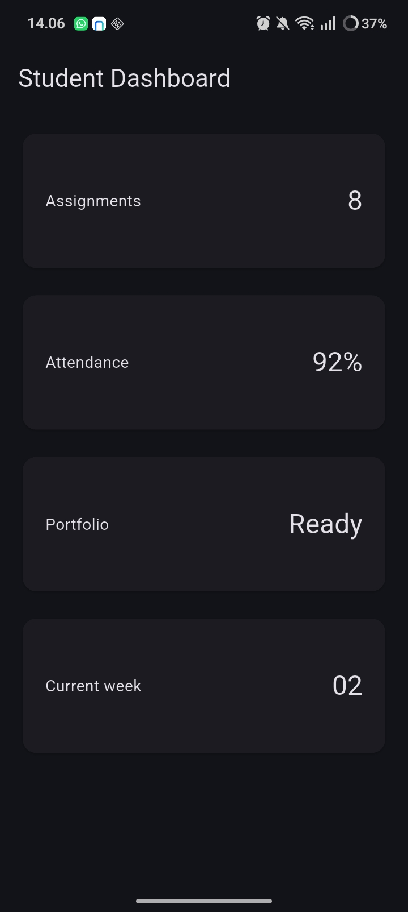
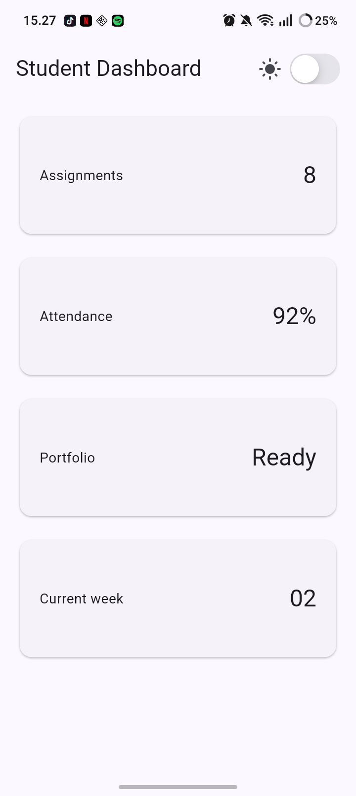
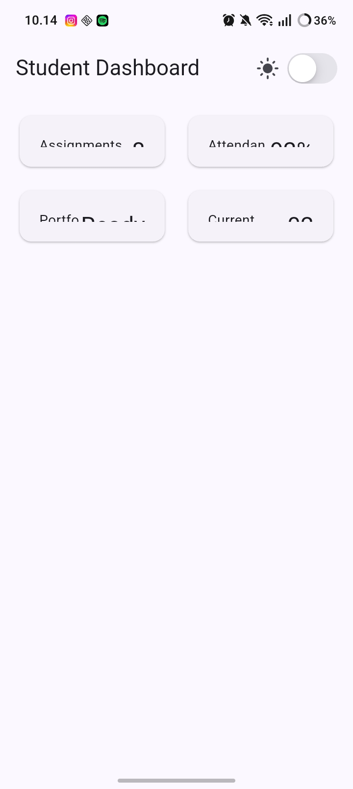
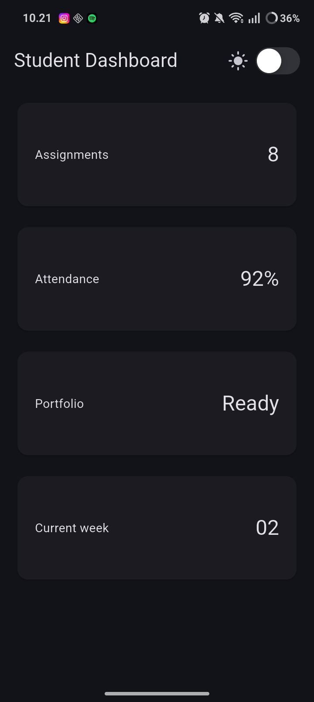
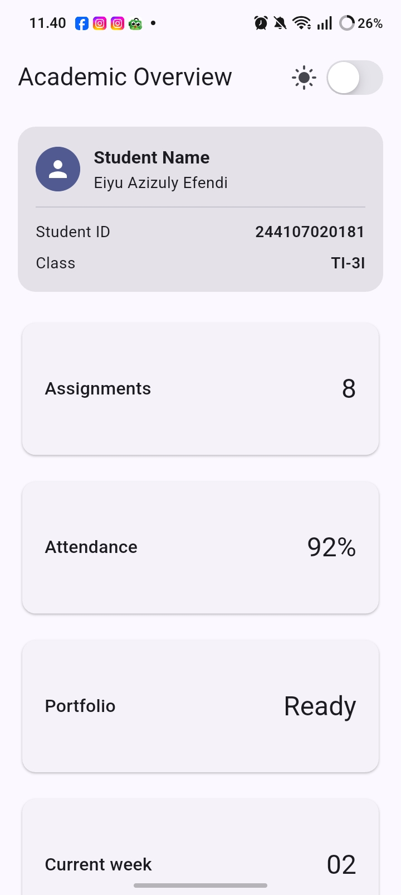
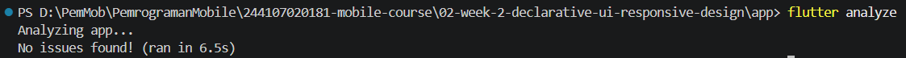
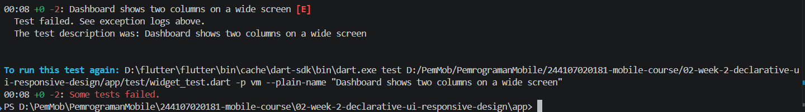

# Flutter Week 2 - Declarative UI and Responsive Design

## Practical lab: responsive dashboard

1. Dashboard 

2. Layout experiments

3. Main Assignment
- Include a profile header and at least four information cards.
- Use Row, Column, Expanded, and Container.
- Show one column on narrow screens and two columns on wide screens.
- Provide readable light and dark themes, with a theme toggle (e.g. a CupertinoSwitch or Switch.adaptive).
- Add accessibility labels for important information or buttons.
- Include narrow- and wide-screen screenshots in screenshots/.

## AI Promt challenge

1. Design Promt
Pure GridView: The fastest to implement for a screen with identical items, but structurally rigid. It makes adding a full-width header difficult and provides a poor accessibility experience because screen readers read the data without providing upfront context.

LayoutBuilder + Column (Recommended): Requires careful constraint management (like using the Expanded widget), but provides much better layout flexibility. It cleanly separates the static user profile from the scrollable metrics, creating a standard dashboard look and a logical, easy-to-follow document hierarchy for assistive technologies.

2. Concept-reinforcement promt
The logic behind Expanded is to calculate the remaining available space and stretch the child to fill it. However, if the Row is inside a horizontally scrollable area or another unconstrained widget, the available space is infinite. Flutter cannot calculate "the remaining space of infinity," so the app throws an error.

3. Verification prompt.
Responsiveness. It works perfectly below 600px by snapping to a single column. The only minor risk is on extremely narrow screens (under 300px), where the fixed childAspectRatio might make the cards too short for their text.

## Testing & Analysis

flutter analyze

flutter test 

## Reflection
1. Writing detailed instructions to directly alter the user interface (e.g., locating a widget and manually editing its text) is a requirement of imperative thinking. Flutter employs declarative thinking, which specifies how the user interface should appear in a particular state. The framework eliminates the need for manual UI modifications when the state changes by automatically rebuilding the widget tree to reflect the new state.

2. Widget to fill the remaining space in a Row or Column, Expanded is quite helpful. However, if it is positioned inside a parent that has unlimited restrictions (such as a ListView or SingleChildScrollView), it results in layout issues since the Expanded widget will attempt to grow indefinitely, raising a render box exception.

3. Breakpoints ensure the app reshapes itself to fit different screen sizes. Themes adjust the colors to improve readability and match user preferences.

4. verified that the recommended layout was responsive on small screens, accessible for screen readers, and built using stable, standard Flutter widgets.

