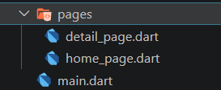
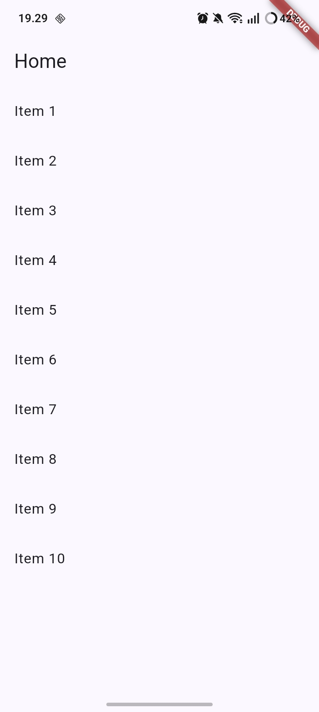
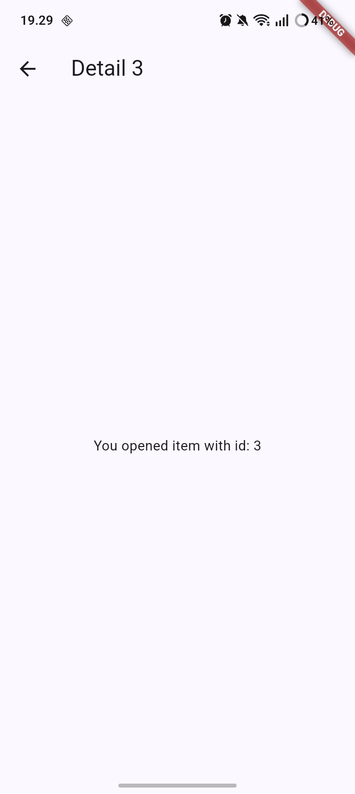
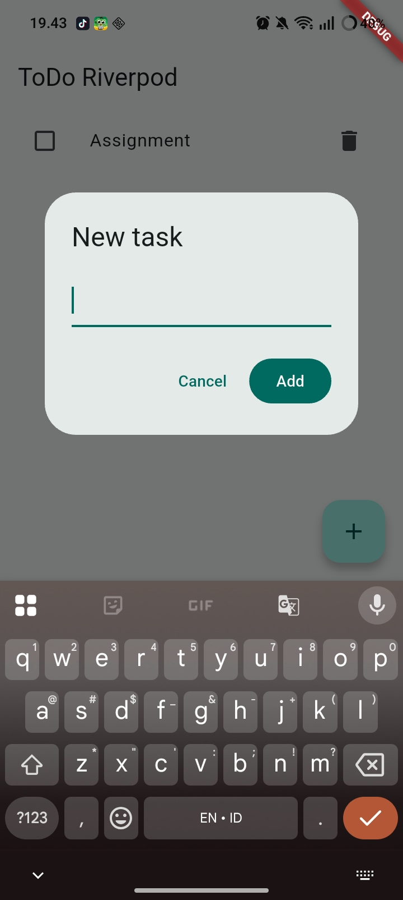
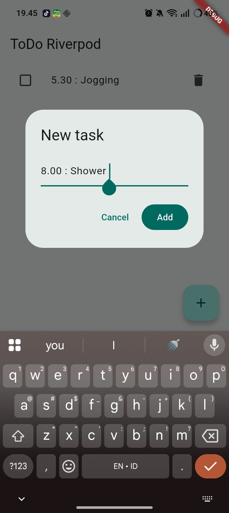
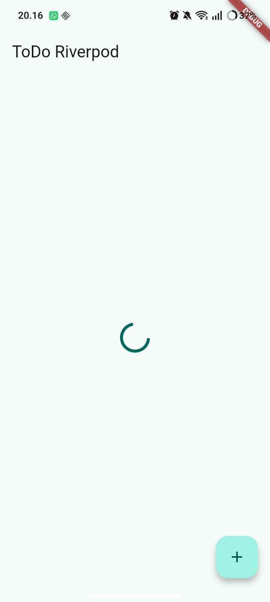
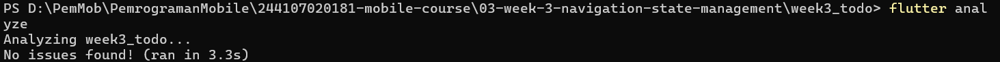
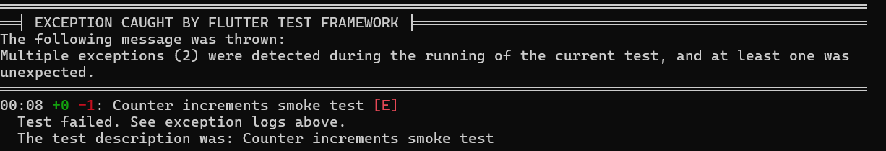

# Flutter Week 3 - Navigation & State Management

Build navigation and apply Riverpod-based state maagement with loading, error, and success states.

## Navigation concepts and GoRouter

## Lab 1 — Multi-page application with GoRouter

**Create new project :**
flutter create week3_navigation
cd week3_navigation
flutter pub add go_router

**Structure:**

navigation

## Lab 2 — ToDo application with Riverpod

**Create new project :**
flutter create week3_todo
cd week3_todo
flutter pub add flutter_riverpod

## Lab 3 - Test 

## Test todo

## flutter analyze/test todo

## Reflection
1. When is setState still enough, and when should state be lifted into Riverpod? The setState method is best utilized for temporary, localized UI changes within a single widget, such as managing form inputs, simple toggles, or animations. However, state management should transition to Riverpod when data must persist across navigation routes or be shared between unconnected widgets, such as a ToDo list and its related metrics. Furthermore, Riverpod should be implemented whenever the data involves asynchronous operations or requires isolated testing independent of the user interface.
2. What is the difference between context.go and context.push, and when should each be used? The context.go method updates the application's navigation history to match a specific path, making it ideal for main menu navigation, bottom tabs, or deep-linking where a clean and predictable routing structure is required. In contrast, context.push simply adds a new page on top of the current screen, which automatically guarantees a back button. Because of this, context.push is best suited for temporary flows, pop-up modals, or viewing item details from a list where the user expects to easily return to the previous view.
3. How does AsyncValue prevent bugs compared with three separate booleans? Using individual variables for loading, error, and data states can lead to bugs, such as the application showing both a loading indicator and an error message simultaneously. AsyncValue resolves this issue by treating these conditions as mutually exclusive, meaning the state can only be loading, error, or data at any given moment. Furthermore, by requiring developers to use methods like .when() to handle the data, it forces every possible outcome to be addressed, which prevents forgotten edge cases and ensures the user interface never displays contradictory information.
4. Which part of the AI output did you fix, and why?
    - Static Analysis / Linter (flutter analyze): Cleaned up unused imports and replaced redundant double-underscore unused parameters (_, __) with single underscores (_, _) to comply with Flutter's strict lint rules.
    - Widget Smoke Test Synchronization: Fixed the Bad state: No ProviderScope found by ensuring the test widget is wrapped with ProviderScope. Additionally, resolved the widget test duplicate text collision caused by dialog dismissal timing by clearing the TextEditingController before popping the dialog and handling async timers cleanly.