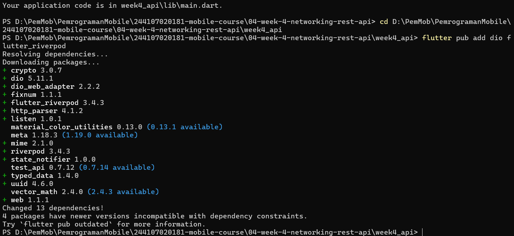
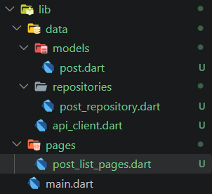
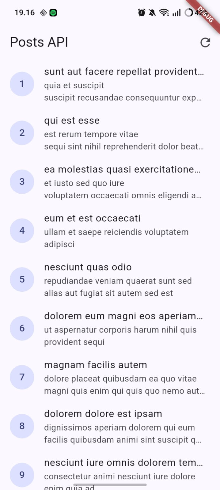
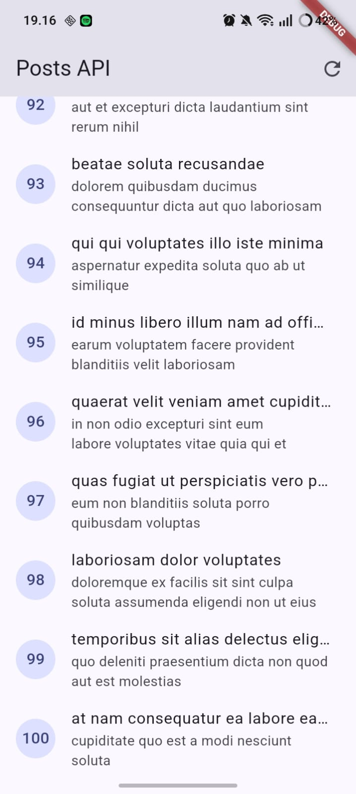
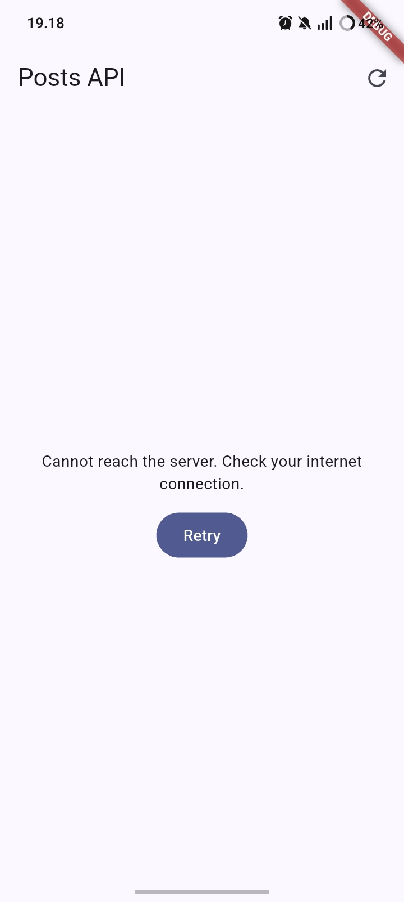
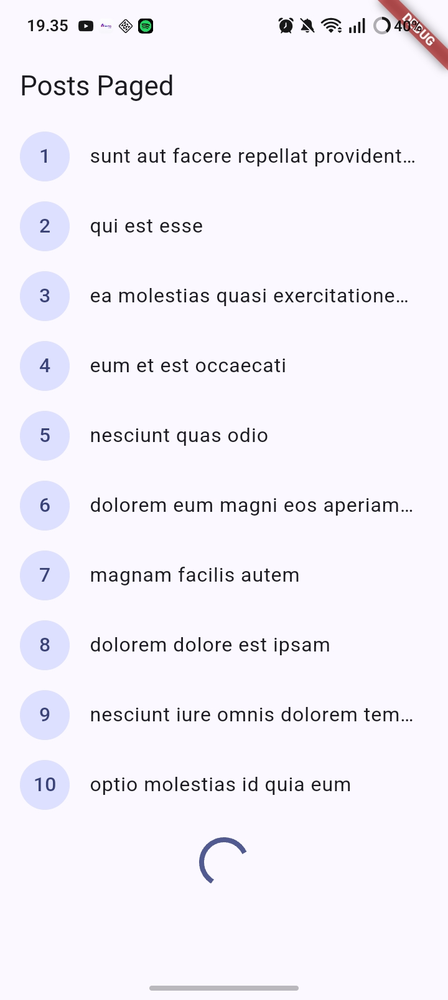
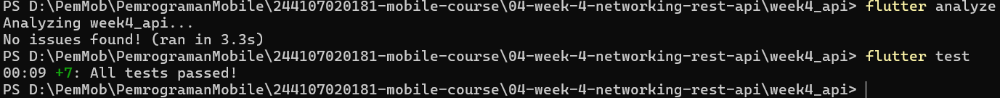

# Flutter week 4 Networking & REST API

## Lab 1 — Dio and data models

**Create new project :**

flutter create week4_api

cd week4_api

flutter pub add dio flutter_riverpod

**Structure:**

## Lab 2: Provider and error handling

## Lab 3: Basic pagination

## Flutter test/analyze

# Assignment

## Why is the UI forbidden from calling Dio directly? What breaks if this rule is violated? 

### If widgets called Dio directly, they'd be responsible for parsing responses, handling errors, and knowing API details, which mixes UI code with network code. Testing becomes painful because every widget test would need a real network call instead of a fake repository. Swapping the HTTP client or API later would mean editing every screen instead of one file. Keeping Dio behind a repository keeps the UI simple and testable.

## When is client-side pagination enough, and when must you rely on server pagination? 

### Client-side pagination works when the full dataset is small and cheap to fetch at once, so you just slice it locally for display. Once the dataset gets large or unbounded, fetching everything upfront wastes bandwidth and memory, so you need server pagination using page and limit parameters so the server only sends the chunk you actually need.

## How do repository exceptions become AsyncError without try/catch in every widget? When is explicit try/catch still needed? 

### Riverpod's AsyncNotifier and FutureProvider automatically wrap the future returned from build in a try/catch internally, so if the repository throws, the state becomes AsyncError on its own. Explicit try/catch is still needed when you're calling something imperatively, like a refresh method triggered by a button, since that call happens outside the framework's automatic wrapping and you want to control how the state updates.

## Which part of the AI output did you fix, and why? 

### The first fix for Comment.fromJson used a nullable cast like postId as num which still crashed when the field came back as a String. I changed it to check the type first and fall back to a default value instead of casting directly, since a cast only tolerates null, not wrong types. I also had to update the widget test to use pumpAndSettle instead of a single pump, since the app makes a network call on startup and a single pump doesn't wait for it to finish.